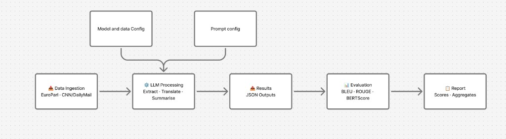
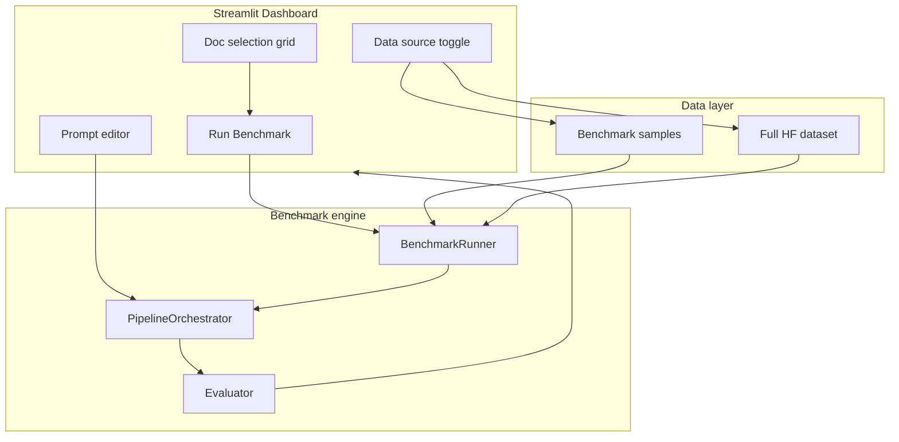

# LLMevallab — Multilingual Document Evaluation and Benchmarking

> Model-agnostic pipeline for extraction, translation, summarisation, and side-by-side LLM benchmarking with industry-standard metrics.

**Author:** [Akash Sachdeva (@BigEyesDev)](https://github.com/BigEyesDev)

**Version:** `0.4.0` — see [CHANGELOG.md](CHANGELOG.md).

---

## Quickstart

One command to launch the dashboard (offline benchmark samples included — no dataset download required):

```bash
cp .env.example .env   # add API keys
uv sync
make run               # → uv run streamlit run app/dashboard.py
```

Or use the Makefile targets:

| Command | What it does |
|---|---|
| `make setup` | `uv sync` + download full HF datasets via `python main.py` |
| `make run` | Launch the Streamlit comparison dashboard |
| `make test` | Run the full pytest suite |

**Minimum API key:** set `GEMINI_API_KEY` in `.env` for the default model. OpenRouter models need `OPENROUTER_API_KEY`.

---

## Dashboard

The local Streamlit dashboard lets you:

- Pick **translation** (DE to EN) or **summarisation** (EN) tasks
- Compare multiple models side-by-side on quality, cost, and latency
- Select documents from **benchmark samples** (30 docs, offline) or the **full HF dataset**
- **View and edit prompts** inline — saved versions are snapshotted to `configs/prompt_history/`
- Browse the last **5 session runs** and restore any previous result
- Export results as JSON or CSV



> **Tip:** Run the dashboard locally and capture a screenshot of the pre-run setup or post-run charts for your own README fork — layout is wide-screen optimised.

---

## Architecture



**Core modules:**

| Path | Role |
|---|---|
| `src/core/concurrency.py` | Bounded parallelism — thread pools and provider semaphores |
| `app/dashboard.py` | Streamlit UI — thin layer over the benchmark engine |
| `src/evaluations/benchmark.py` | Multi-model `BenchmarkRunner` |
| `src/pipeline/orchestrator.py` | Per-document extract, translate, summarise pipeline |
| `src/pipeline/prompt_manager.py` | Load, version, and snapshot prompt templates |
| `configs/config.yaml` | Model catalog, dataset paths, truncation limits |
| `configs/prompts.yaml` | Active LLM prompts (versioned) |

---

## Model catalog

Default model: **`gemini-2.5-flash`**. Full catalog with pricing and smoke-test notes: [docs/MODELS.md](docs/MODELS.md).

| Key | Provider | Model ID | Input $/1M | Output $/1M |
|---|---|---|---|---|
| `gemini-2.5-flash` | Gemini | `gemini-2.5-flash` | $0.075 | $0.30 |
| `claude-sonnet-4-6` | Anthropic | `claude-sonnet-4-6` | $3.00 | $15.00 |
| `gpt-4o-mini` | OpenAI | `gpt-4o-mini` | $0.15 | $0.60 |
| `llama-3.3-70b` | OpenRouter | `meta-llama/llama-3.3-70b-instruct` | $0.10 | $0.32 |
| `deepseek-v3` | OpenRouter | `deepseek/deepseek-chat` | $0.20 | $0.80 |
| `qwen3-30b` | OpenRouter | `qwen/qwen3-30b-a3b` | $0.12 | $0.50 |
| `qwen2.5-72b` | OpenRouter | `qwen/qwen-2.5-72b-instruct` | $0.36 | $0.40 |
| `glm-4-7` | OpenRouter | `z-ai/glm-4.7` | $0.40 | $1.75 |
| `mistral-small-3.2` | OpenRouter | `mistralai/mistral-small-3.2-24b-instruct` | $0.075 | $0.20 |
| `phi-4` | OpenRouter | `microsoft/phi-4` | $0.07 | $0.14 |
| `gemma-3-27b` | OpenRouter | `google/gemma-3-27b-it` | $0.08 | $0.16 |

Pricing is indicative — edit `configs/config.yaml` to update.

---

## What the pipeline does

1. **Ingests** documents (EuroParl for translation, CNN/DailyMail for summarisation)
2. **Extracts** structured information (entities, dates, topics)
3. **Translates** or **summarises** via any catalog model
4. **Evaluates** with BLEU, ROUGE-L, and BERTScore
5. **Compares** models on quality, token usage, cost, and latency

The system is **model-agnostic** — add a provider by implementing `BaseDocumentProcessor` or using `openai_compatible` for OpenRouter models.

---

## CLI (without dashboard)

```bash
# Download and prepare datasets (one-time)
python main.py

# Run pipeline on N docs
python -m src.pipeline.orchestrator --task translation --model gemini-2.5-flash --dataset europarl --sample 5

# Multi-model benchmark (parallel by default — tune in config.yaml)
python -m src.evaluations.benchmark \
  --task summarisation \
  --models gemini-2.5-flash,deepseek-v4-flash \
  --sample 15 \
  --max-concurrent-models 3 \
  --max-concurrent-documents 5 \
  --skip-extract
```

Parallel orchestration design (three options, tuning, CLI): see [docs/learning/PARALLEL_ORCHESTRATION.md](docs/learning/PARALLEL_ORCHESTRATION.md) (local learning doc).

See [RUNBOOK.md](RUNBOOK.md) for operational details.

---

## Evaluation metrics

| Metric | Use case | Good score (rule of thumb) |
|---|---|---|
| **BLEU** | Translation | > 0.30 |
| **COMET** | Translation | > 0.80 |
| **ROUGE-L** | Summarisation | > 0.25 |
| **LLM Judge** | Summarisation | > 0.60 (normalized mean) |
| **BERTScore** | Both | > 0.70 (F1) |

---

## Project structure

```
app/dashboard.py              ← Streamlit dashboard
configs/
├── config.yaml               ← models, datasets, paths
├── prompts.yaml              ← active prompts (versioned)
└── prompt_history/           ← prompt snapshots on save
data/benchmark_samples/       ← 30-doc offline slices (committed)
src/
├── core/                     ← models, config, pricing
├── providers/                ← Gemini, Claude, OpenAI-compatible
├── pipeline/                 ← orchestrator, loaders, prompt_manager
└── evaluations/              ← metrics, evaluator, benchmark runner
tests/                        ← pytest suite
```

---

## Further reading

- [RUNBOOK.md](RUNBOOK.md) — operations and troubleshooting
- [docs/MODELS.md](docs/MODELS.md) — model quirks and smoke-test notes
- [CHANGELOG.md](CHANGELOG.md) — release history
